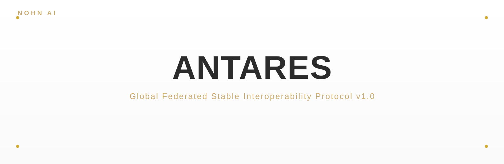
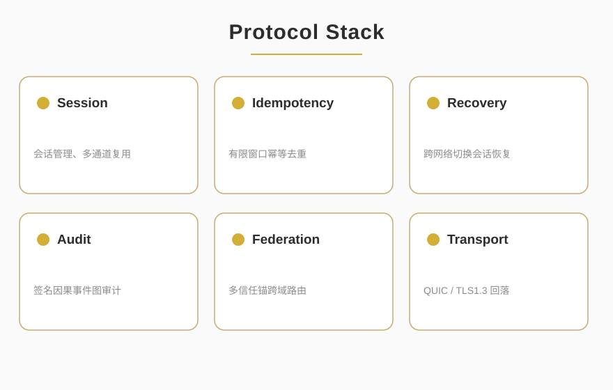

<p align="center">
  
</p>

<p align="center">
  
  
  
  
</p>

<blockquote align="center">
  <em>全局联邦稳定互操作协议 GFSIP v1.0</em>
</blockquote>

<p align="center">
  <a href="README.md">English</a> | 简体中文
</p>

<div style="max-width:880px;margin:0 auto;padding:0 16px">

## ✦ 关于

<p style="font-size:15px;line-height:1.8;color:#2C2C2C">ANTARES 即 GFSIP v1.0 —— 全局联邦稳定互操作协议。它为服务、AI 智能体、设备与组织提供加密、多路复用、可恢复的跨域通信，且无需中心权威。以 QUIC 为强制传输层，配合确定性 CBOR 序列化，内置会话恢复、幂等去重与因果审计，是去中心化网络的稳定基石。</p>

<p align="center">
  
</p>

</div>

<p align="center">— ✦ —</p>

## ✦ 系统架构（人话版）

> **一句话：** ANTARES 让你的服务、AI 智能体或设备能安全地和任何人通信——跨机构也行，而且**中间不需要一台中心服务器**。

```mermaid
flowchart TB
    UP["👤 你的服务 · AI 智能体 · 设备（调用方）<br/>业务请求：支付 · 消息 · 数据同步"]

    A1["🚪 reference-impl/gfsip/endpoint.py · transport.py<br/>建立 QUIC 连接，进入 GFSIP 会话"]
    A2["🤝 auth.py · frame.py<br/>互认证 + 版本协商：44 字节定长头 · ALPN gfsip/1"]
    A3["📜 GFSIP_v1.0_protocol_spec.md · gfsip-state-machine.json<br/>协议规格 + 状态机：约束合法状态与迁移"]
    A4["🔌 channel.py<br/>开通道：一条会话内多路复用，开多条逻辑通道"]
    A5["🧬 cbor_utils.py<br/>传数据：CBOR 确定性编码，逐帧发送"]
    A6["🔁 dedupe.py<br/>幂等去重：幂等键 + 窗口去重，重复请求只执行一次"]
    A7["🔄 resume.py<br/>断网恢复：网络切换后免重认证续传"]
    A8["📒 audit.py · signing.py<br/>因果审计：签名事件 + 声明因果前驱，拒绝自环与环路"]
    A9["🌐 federation.py<br/>跨域路由：签名 DomainDescriptor + 多信任锚 + 故障隔离"]
    A10["⚠️ gfsip-error-registry.json · gfsip-message-schema.json<br/>错误码注册表 + 消息模式：异常统一编号"]
    A11["✅ gfsip-conformance-checklist.csv · CONFORMANCE.md<br/>一致性检查清单与判定标准"]

    OUT["📦 跨域会话达成<br/>加密 · 可续传 · 可审计 · 可幂等"]
    HUMAN["✍️ 人工签署一致性结论<br/>最终结论留在算法之外"]

    UP --> A1
    A1 --> A2
    A2 --> A3
    A3 --> A4
    A4 --> A5
    A5 --> A6
    A6 --> A7
    A7 --> A8
    A8 --> A9
    A9 --> A10
    A10 --> A11
    A11 --> OUT
    OUT --> HUMAN

    classDef cUp fill:#F5F5F5,stroke:#9E9E9E,stroke-width:1px,color:#424242
    classDef cIn fill:#E8F0FE,stroke:#4285F4,stroke-width:1px,color:#173A66
    classDef cCore fill:#FFF8E1,stroke:#C9A96E,stroke-width:1px,color:#5B4614
    classDef cSide fill:#F3E8FD,stroke:#8E44AD,stroke-width:1px,color:#4A235A
    classDef cOut fill:#E6F4EA,stroke:#34A853,stroke-width:1px,color:#14512B
    class UP cUp
    class A1 cIn
    class A2,A4,A5,A6,A7,A9 cCore
    class A3,A8,A10,A11 cSide
    class OUT,HUMAN cOut
```



**这张图怎么看**

1. 从上往下读是**一次会话的时序**：建立连接 → 认证 → 开通道 → 传数据 → 去重 → 断网恢复 → 审计 → 跨域路由；顶部进请求，底部出一次已签名的跨域会话。
2. 每个框都写了 `reference-impl/gfsip/` 里**真实可点开的实现文件**，以及对应的规格件，可逐步对着源码看。
3. 最关键的边界：**没有中心机构**——审计与联邦只是可选的 **Core / Audit / Federation** 档位，不是必选层。

📖 每个术语都用一句人话解释 → [术语表 GLOSSARY](./GLOSSARY.md)

## ✦ 核心能力

<div style="max-width:880px;margin:0 auto;padding:0 16px">

<table style="width:100%;border-collapse:collapse;font-size:14px">
  <tr><th style="text-align:left;color:#C9A96E;padding:8px;border-bottom:1px solid #E5DCC4">#</th><th style="text-align:left;color:#C9A96E;padding:8px;border-bottom:1px solid #E5DCC4">能力</th><th style="text-align:left;color:#C9A96E;padding:8px;border-bottom:1px solid #E5DCC4">说明</th></tr>
  <tr><td style="padding:8px;border-bottom:1px solid #F0EAD9">1</td><td style="padding:8px;border-bottom:1px solid #F0EAD9"><strong>加密会话</strong></td><td style="padding:8px;border-bottom:1px solid #F0EAD9">基于 QUIC 的相互认证 TLS 或令牌认证会话</td></tr>
  <tr><td style="padding:8px;border-bottom:1px solid #F0EAD9">2</td><td style="padding:8px;border-bottom:1px solid #F0EAD9"><strong>多路复用</strong></td><td style="padding:8px;border-bottom:1px solid #F0EAD9">单一会话内的独立逻辑通道</td></tr>
  <tr><td style="padding:8px;border-bottom:1px solid #F0EAD9">3</td><td style="padding:8px;border-bottom:1px solid #F0EAD9"><strong>会话恢复</strong></td><td style="padding:8px;border-bottom:1px solid #F0EAD9">网络切换后无需重新认证即可恢复会话</td></tr>
  <tr><td style="padding:8px;border-bottom:1px solid #F0EAD9">4</td><td style="padding:8px;border-bottom:1px solid #F0EAD9"><strong>幂等副作用</strong></td><td style="padding:8px;border-bottom:1px solid #F0EAD9">基于幂等键的窗口化去重</td></tr>
  <tr><td style="padding:8px;border-bottom:1px solid #F0EAD9">5</td><td style="padding:8px;border-bottom:1px solid #F0EAD9"><strong>因果审计（可选）</strong></td><td style="padding:8px;border-bottom:1px solid #F0EAD9">带已声明因果前驱的签名事件记录</td></tr>
  <tr><td style="padding:8px;border-bottom:1px solid #F0EAD9">6</td><td style="padding:8px;border-bottom:1px solid #F0EAD9"><strong>跨域联邦</strong></td><td style="padding:8px;border-bottom:1px solid #F0EAD9">多信任锚路由 + 签名域描述符</td></tr>
  <tr><td style="padding:8px">7</td><td style="padding:8px"><strong>故障隔离</strong></td><td style="padding:8px">单一域故障不会阻塞域内流量</td></tr>
</table>

</div>

<p align="center">— ✦ —</p>

## ✦ 线格式

<div style="max-width:880px;margin:0 auto;padding:0 16px">

<p style="font-size:15px;line-height:1.8;color:#2C2C2C">GFSIP 在 QUIC 之上使用 <strong>44 字节定长报头</strong>，ALPN 为 <code style="background:#F5F0E6;padding:2px 6px;border-radius:3px;color:#C9A96E">gfsip/1</code>。扩展头使用确定性 CBOR（大端、最短编码）。18 种标准消息类型（<code>0x01</code>–<code>0x16</code>）覆盖完整生命周期：握手、通道管理、数据传输、会话恢复、审计事件与联邦路由。</p>

</div>

<p align="center">— ✦ —</p>

## ✦ 仓库内容

<div style="max-width:880px;margin:0 auto;padding:0 16px">

<table style="width:100%;border-collapse:collapse;font-size:14px">
  <tr><th style="text-align:left;color:#C9A96E;padding:8px;border-bottom:1px solid #E5DCC4">文件</th><th style="text-align:left;color:#C9A96E;padding:8px;border-bottom:1px solid #E5DCC4">用途</th></tr>
  <tr><td style="padding:8px;border-bottom:1px solid #F0EAD9"><code>GFSIP_v1.0_protocol_spec.md</code></td><td style="padding:8px;border-bottom:1px solid #F0EAD9">完整协议规范（33 节）</td></tr>
  <tr><td style="padding:8px;border-bottom:1px solid #F0EAD9"><code>gfsip-state-machine.json</code></td><td style="padding:8px;border-bottom:1px solid #F0EAD9">机器可读的状态机定义</td></tr>
  <tr><td style="padding:8px;border-bottom:1px solid #F0EAD9"><code>gfsip-message-schema.json</code></td><td style="padding:8px;border-bottom:1px solid #F0EAD9">逻辑消息 JSON Schema</td></tr>
  <tr><td style="padding:8px;border-bottom:1px solid #F0EAD9"><code>gfsip-error-registry.json</code></td><td style="padding:8px;border-bottom:1px solid #F0EAD9">数值错误码登记表</td></tr>
  <tr><td style="padding:8px;border-bottom:1px solid #F0EAD9"><code>gfsip-conformance-checklist.csv</code></td><td style="padding:8px;border-bottom:1px solid #F0EAD9">一致性测试清单</td></tr>
  <tr><td style="padding:8px;border-bottom:1px solid #F0EAD9"><code><a href="./CONFORMANCE-zh.md">CONFORMANCE-zh.md</a></code></td><td style="padding:8px;border-bottom:1px solid #F0EAD9">一致性测试指南 —— 从规范性工件自行推导测试用例（面向第三方评估方）</td></tr>
  <tr><td style="padding:8px"><code>reference-impl/</code></td><td style="padding:8px">Python 参考实现 —— 帧编解码、状态机、通道管理、认证、去重、恢复、审计、联邦、端到端演示（9/9 一致性向量通过）</td></tr>
</table>

</div>

<p align="center">— ✦ —</p>

## ✦ 协议档位

<div style="max-width:880px;margin:0 auto;padding:0 16px">

<p style="font-size:15px;line-height:1.8;color:#2C2C2C"><strong style="color:#C9A96E">Core/1（强制）</strong> —— QUIC 传输、版本协商、相互认证、会话与通道管理、会话恢复、结构化错误、优雅关闭。</p>

<p style="font-size:15px;line-height:1.8;color:#2C2C2C"><strong style="color:#C9A96E">Audit/1（可选）</strong> —— 带已声明因果前驱、行为者身份、规则版本与前/后状态哈希的签名因果事件记录；拒绝自环与已知环。</p>

<p style="font-size:15px;line-height:1.8;color:#2C2C2C"><strong style="color:#C9A96E">Federation/1（可选）</strong> —— 通过签名的 <code>DomainDescriptor</code> 对象进行跨域路由、多信任锚配置、描述符过期/撤销与故障隔离。</p>

</div>

<p align="center">— ✦ —</p>

## ✦ 快速开始

```bash
# 安装 SDK（PyPI）
pip install gfsip

# 运行端到端演示（克隆仓库以获取演示文件）
git clone https://github.com/nohn3043-arch/Antares.git
cd Antares/reference-impl
pip install -r requirements.txt
python demo.py                # 同步 API 演示：握手 -> 通道 -> 数据 -> 去重 -> 恢复
python async_demo.py          # 异步 API 演示：await connect/open_channel/send（零手动泵）
python -m gfsip.conformance   # 9/9 第 28 节最小向量 —— 作者自测，详见 CONFORMANCE-zh.md
```

<p align="center">— ✦ —</p>

## ✦ 应用场景

<div style="max-width:880px;margin:0 auto;padding:0 16px">

- **AI 智能体网络** —— 跨组织边界的多智能体任务协作，带可审计轨迹
- **企业集成** —— 无需中心权威的跨组织工作流编排
- **IoT / 边缘** —— 网络切换下的设备到云会话恢复
- **金融 / 合规** —— 用于监管报送的签名因果审计链
- **医疗健康** —— 带域级策略强制的联邦数据交换
- **机器人** —— 用于幂等安全操作的可靠指令通道

</div>

<p align="center">— ✦ —</p>

## ✦ 项目状态

<div style="max-width:880px;margin:0 auto;padding:0 16px">

<table style="width:100%;border-collapse:collapse;font-size:14px">
  <tr><th style="text-align:left;color:#C9A96E;padding:8px;border-bottom:1px solid #E5DCC4">里程碑</th><th style="text-align:left;color:#C9A96E;padding:8px;border-bottom:1px solid #E5DCC4">状态</th></tr>
  <tr><td style="padding:8px;border-bottom:1px solid #F0EAD9">规范 v1.0（接口冻结）</td><td style="padding:8px;border-bottom:1px solid #F0EAD9">✅ 完成</td></tr>
  <tr><td style="padding:8px;border-bottom:1px solid #F0EAD9">机器可读状态机与 schema</td><td style="padding:8px;border-bottom:1px solid #F0EAD9">✅ 完成</td></tr>
  <tr><td style="padding:8px;border-bottom:1px solid #F0EAD9">Python 参考实现（9/9 一致性）</td><td style="padding:8px;border-bottom:1px solid #F0EAD9">✅ 完成</td></tr>
  <tr><td style="padding:8px;border-bottom:1px solid #F0EAD9">PyPI 包发布（pip install gfsip）</td><td style="padding:8px;border-bottom:1px solid #F0EAD9">✅ 完成</td></tr>
  <tr><td style="padding:8px;border-bottom:1px solid #F0EAD9">异步高层 API（AsyncEndpoint，零手动泵）</td><td style="padding:8px;border-bottom:1px solid #F0EAD9">✅ 完成</td></tr>
  <tr><td style="padding:8px;border-bottom:1px solid #F0EAD9">独立第二实现</td><td style="padding:8px;border-bottom:1px solid #F0EAD9">🔲 进行中</td></tr>
  <tr><td style="padding:8px;border-bottom:1px solid #F0EAD9">公开互操作性报告</td><td style="padding:8px;border-bottom:1px solid #F0EAD9">🔲 待办</td></tr>
  <tr><td style="padding:8px">生产试点域</td><td style="padding:8px">🔲 待办</td></tr>
</table>

</div>

<p align="center">— ✦ —</p>

## ✦ 生态

ANTARES 是 NOHN AI 生态的一员 —— 一个围绕第二视角因果审计与确定性执行构建的项目家族：

| 项目 | 仓库 | 角色 |
|---|---|---|
| **Second-Perspective (GCAE)** | [nohn3043-arch/second-perspective](https://github.com/nohn3043-arch/second-perspective) | 全局认知审计引擎 —— 五算子因果审计内核（IMDA 95/100） |
| **NOMOS** | [nohn3043-arch/second-perspective](https://github.com/nohn3043-arch/second-perspective)（`Intelligent-Decision-Hub--Nomos` 分支） | 可审计的确定性决策中枢（IMDA 95/100） |
| **SPL-G1** | [nohn3043-arch/SPL-G1](https://github.com/nohn3043-arch/SPL-G1) | 硬件因果审计可信计算单元（TCU） |
| **SPL-Virtual-World-Base** | [nohn3043-arch/Second-Reality](https://github.com/nohn3043-arch/Second-Reality) | 虚拟世界与元宇宙基础设施（宪法 / 法律 / 桥） |
| **Story-Engine** | [nohn3043-arch/story-engine](https://github.com/nohn3043-arch/story-engine) | 长篇叙事一致性引擎 |
| **Antares** | [nohn3043-arch/Antares](https://github.com/nohn3043-arch/Antares) | GFSIP v1.0 —— 带因果审计的联邦稳定互操作协议 |
| **Anthropomorphic-Agent-Engine** | [nohn3043-arch/Anthropomorphic-Agent-Engine](https://github.com/nohn3043-arch/Anthropomorphic-Agent-Engine) | 确定性拟人心理引擎（SPL Pure Core V8.0） |
| **PAGES** | [nohn3043-arch/pages](https://github.com/nohn3043-arch/pages) | NOHN AI 生态官方落地页 |

<p align="center">— ✦ —</p>

## ✦ 许可

本仓库采用<strong>双轨许可</strong>：

<table style="width:100%;border-collapse:collapse;font-size:14px">
  <tr><th style="text-align:left;color:#C9A96E;padding:8px;border-bottom:1px solid #E5DCC4">内容</th><th style="text-align:left;color:#C9A96E;padding:8px;border-bottom:1px solid #E5DCC4">许可</th><th style="text-align:left;color:#C9A96E;padding:8px;border-bottom:1px solid #E5DCC4">文件</th></tr>
  <tr><td style="padding:8px;border-bottom:1px solid #F0EAD9"><strong>代码实现</strong>（<code>reference-impl/</code> 下的 Python 包 <code>gfsip</code>）</td><td style="padding:8px;border-bottom:1px solid #F0EAD9"><a href="https://www.apache.org/licenses/LICENSE-2.0">Apache License 2.0</a></td><td style="padding:8px;border-bottom:1px solid #F0EAD9"><a href="./LICENSE"><code>LICENSE</code></a></td></tr>
  <tr><td style="padding:8px"><strong>协议规范与文档</strong>（<code>GFSIP_v1.0_protocol_spec.md</code>、<code>gfsip-*.json</code>、<code>gfsip-*.csv</code>、<code>assets/</code> 图示）</td><td style="padding:8px"><a href="https://creativecommons.org/licenses/by/4.0/">CC BY 4.0</a></td><td style="padding:8px"><a href="./LICENSE-SPEC.md"><code>LICENSE-SPEC.md</code></a></td></tr>
</table>

Apache-2.0 允许商业使用、修改与分发，并含<strong>明示专利授权</strong>；CC BY 4.0 允许在仅署名条件下的任何使用与再分发（含商业使用）—— 为规范采用这种开放的署名许可，服务于 GFSIP 作为开放标准的传播目标。

> **不可撤销声明**：截至 v1.0（含）的版本此前已整体以 CC BY 4.0 发布（含代码）。该许可依其条款不可撤销，这些版本将永久可依 CC BY 4.0 使用。上述双轨安排自下一版本起生效。

- **联系**：国际 / 全球 —— [ai@nohnlins.com](mailto:ai@nohnlins.com) · 中国 —— [lin@secondai.top](mailto:lin@secondai.top)

<p align="center">
  <a href="https://github.com/nohn3043-arch">GitHub</a>
  &nbsp;·&nbsp;
  <a href="https://www.nohnlins.com/">nohnlins.com</a>
  &nbsp;·&nbsp;
  <a href="mailto:ai@nohnlins.com">ai@nohnlins.com</a>
</p>
<p align="center"><sub>NOHN AI · ANTARES</sub></p>
