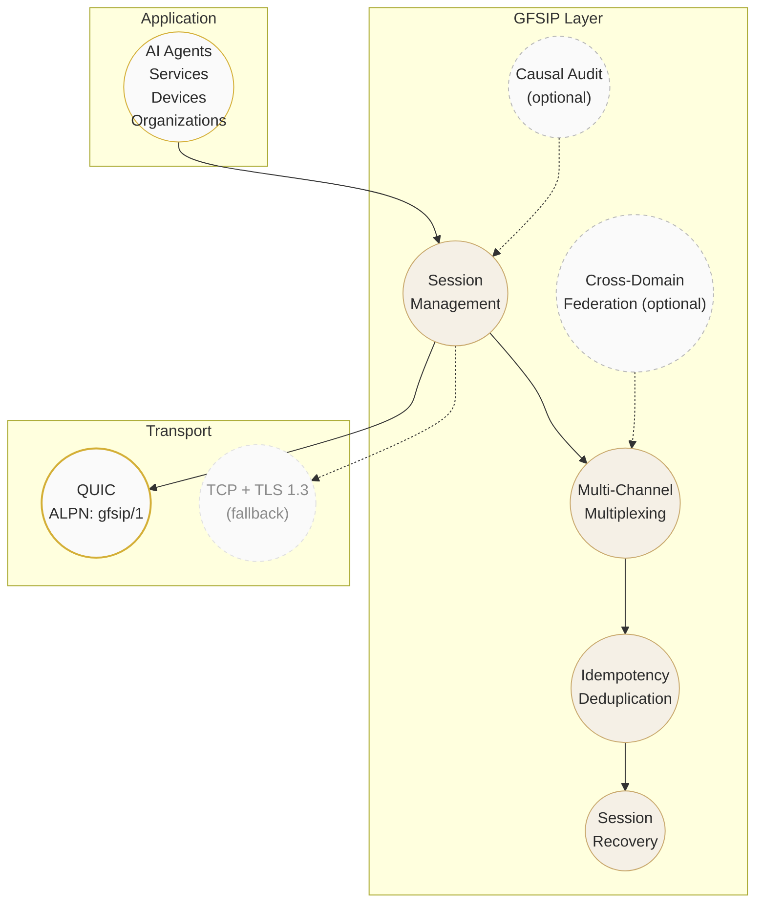
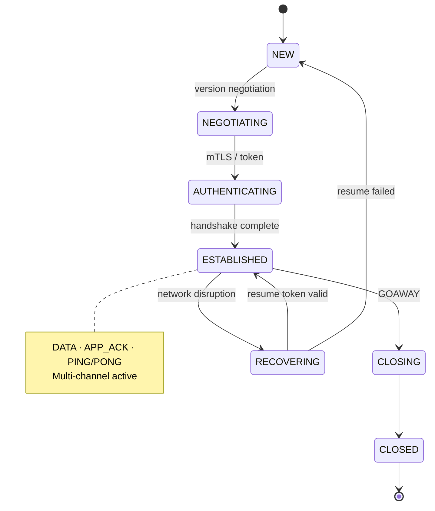

<p align="center">
  <em>The virtual world requires a universal and stable network.</em>
</p>

<p align="center">
  
  
  
  
  
</p>

---

&nbsp;

## ✦ Antares — GFSIP v1.0

**Global Federated Stable Interoperability Protocol**

Encrypted, multi-channel, recoverable cross-domain communication for services, AI agents, devices, and organizations — **no central authority required.**

&nbsp;

## ✦ Protocol Stack



&nbsp;

## ✦ Session Lifecycle



&nbsp;

## ✦ 44-byte Fixed Header

```
 0                   1                   2                   3
 0 1 2 3 4 5 6 7 8 9 0 1 2 3 4 5 6 7 8 9 0 1 2 3 4 5 6 7 8 9 0 1
+-+-+-+-+-+-+-+-+-+-+-+-+-+-+-+-+-+-+-+-+-+-+-+-+-+-+-+-+-+-+-+-+
|                       Magic = "GFS1"                         |
+-+-+-+-+-+-+-+-+-+-+-+-+-+-+-+-+-+-+-+-+-+-+-+-+-+-+-+-+-+-+-+-+
| Major | Minor | Type          | Flags                         |
+-+-+-+-+-+-+-+-+-+-+-+-+-+-+-+-+-+-+-+-+-+-+-+-+-+-+-+-+-+-+-+-+
| Header Length                 | Reserved                      |
+-+-+-+-+-+-+-+-+-+-+-+-+-+-+-+-+-+-+-+-+-+-+-+-+-+-+-+-+-+-+-+-+
|                         Payload Length                        |
+-+-+-+-+-+-+-+-+-+-+-+-+-+-+-+-+-+-+-+-+-+-+-+-+-+-+-+-+-+-+-+-+
|                    Session ID (128 bits)                      |
+-+-+-+-+-+-+-+-+-+-+-+-+-+-+-+-+-+-+-+-+-+-+-+-+-+-+-+-+-+-+-+-+
|                     Sequence (64 bits)                        |
+-+-+-+-+-+-+-+-+-+-+-+-+-+-+-+-+-+-+-+-+-+-+-+-+-+-+-+-+-+-+-+-+
|                      Channel ID (32 bits)                     |
+-+-+-+-+-+-+-+-+-+-+-+-+-+-+-+-+-+-+-+-+-+-+-+-+-+-+-+-+-+-+-+-+
|              Extension Header (deterministic CBOR)            |
+-+-+-+-+-+-+-+-+-+-+-+-+-+-+-+-+-+-+-+-+-+-+-+-+-+-+-+-+-+-+-+-+
```

&nbsp;

## ✦ Key Capabilities

| # | Capability | Approach |
|---|-----------|----------|
| 1 | **Encrypted Sessions** | mTLS / token-based over QUIC |
| 2 | **Multi-Channel** | Independent logical channels per session |
| 3 | **Session Recovery** | Resume across network switches |
| 4 | **Idempotent Side Effects** | Limited-window key deduplication |
| 5 | **Structured Errors** | Numeric codes with scope + retry hints |
| 6 | **Causal Audit** | Signed event records with causal predecessors |
| 7 | **Cross-Domain Federation** | Multi-trust-anchor routing |
| 8 | **Fault Isolation** | Single-domain failure → no blocking |

&nbsp;

## ✦ Protocol Profiles

| Profile | Status | Content |
|---------|--------|---------|
| `Core/1` | **Mandatory** | QUIC, version negotiation, auth, session/channel, DATA+ACK, PING/PONG, GOAWAY, errors, recovery, idempotency |
| `Audit/1` | Optional | Signed causal event graph, identity binding, cycle rejection |
| `Federation/1` | Optional | Domain descriptors, multi-trust-anchor, route queries, expiry/revocation |

&nbsp;

## ✦ Quick Start

```bash
cd reference-impl
pip install -r requirements.txt

# 5-scenario end-to-end demo
python demo.py

# Conformance vectors (9/9 pass)
python conformance.py
```

&nbsp;

## ✦ Use Cases

> Enterprise Integration · AI Agent Networks · IoT / Edge · Finance Compliance · Healthcare · Robotics

&nbsp;

## ✦ Project Status

| Milestone | Status |
|-----------|--------|
| Specification v1.0 | ✅ Complete |
| State machine & schema | ✅ Complete |
| Conformance checklist | ✅ Complete |
| Two independent implementations | 🔲 In progress |
| Public interop report | 🔲 Pending |
| Independent security audit | 🔲 Pending |

&nbsp;

---

<p align="center">
  <a href="./GFSIP_v1.0_protocol_spec.md">Protocol Spec</a>
  &nbsp;·&nbsp;
  <a href="mailto:ai@nohnlins.com">ai@nohnlins.com</a>
</p>
<p align="center">
  <sub>CC BY 4.0 · GFSIP Contributors</sub>
</p>
