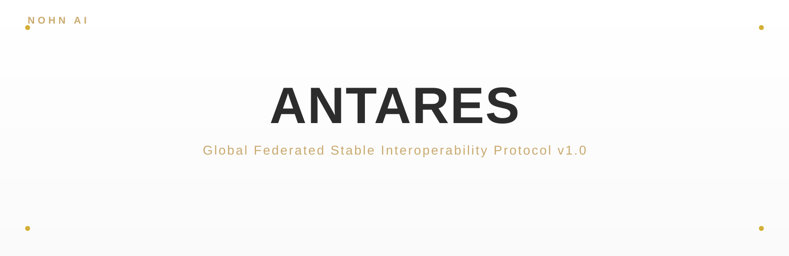
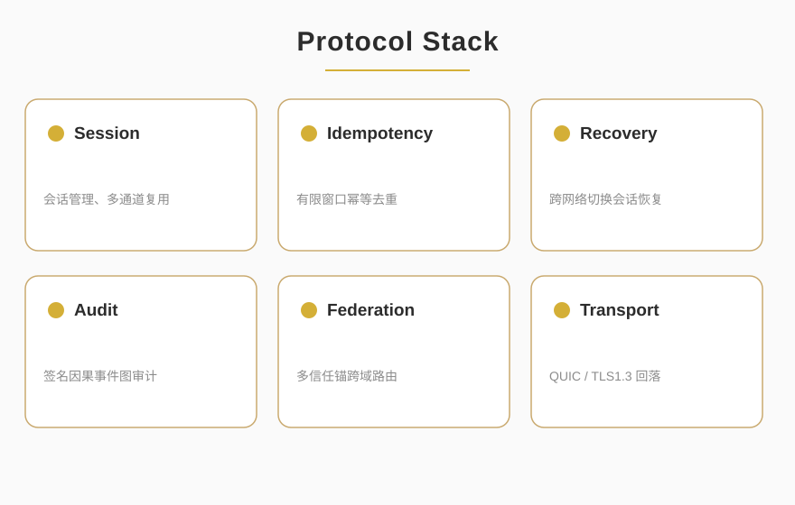

<p align="center">
  
</p>

<p align="center">
  
  
  
  
</p>

<blockquote align="center">
  <em>Global Federated Stable Interoperability Protocol v1.0</em>
</blockquote>

<div style="max-width:880px;margin:0 auto;padding:0 16px">

## ✦ About

<p style="font-size:15px;line-height:1.8;color:#2C2C2C">ANTARES is GFSIP v1.0 — the Global Federated Stable Interoperability Protocol. It provides encrypted, multi-channel, recoverable cross-domain communication for services, AI agents, devices, and organizations with no central authority required. Built on QUIC as the mandatory transport layer and deterministic CBOR serialization, it includes built-in session recovery, idempotent deduplication, and causal auditing as the stable foundation for decentralized networks.</p>

<p align="center">
  
</p>

</div>

<p align="center">— ✦ —</p>

## ✦ Key Capabilities

<div style="max-width:880px;margin:0 auto;padding:0 16px">

<table style="width:100%;border-collapse:collapse;font-size:14px">
  <tr><th style="text-align:left;color:#C9A96E;padding:8px;border-bottom:1px solid #E5DCC4">#</th><th style="text-align:left;color:#C9A96E;padding:8px;border-bottom:1px solid #E5DCC4">Capability</th><th style="text-align:left;color:#C9A96E;padding:8px;border-bottom:1px solid #E5DCC4">Description</th></tr>
  <tr><td style="padding:8px;border-bottom:1px solid #F0EAD9">1</td><td style="padding:8px;border-bottom:1px solid #F0EAD9"><strong>Encrypted Sessions</strong></td><td style="padding:8px;border-bottom:1px solid #F0EAD9">Mutual-TLS or token-based authenticated sessions over QUIC</td></tr>
  <tr><td style="padding:8px;border-bottom:1px solid #F0EAD9">2</td><td style="padding:8px;border-bottom:1px solid #F0EAD9"><strong>Multi-Channel</strong></td><td style="padding:8px;border-bottom:1px solid #F0EAD9">Independent logical channels within a single session</td></tr>
  <tr><td style="padding:8px;border-bottom:1px solid #F0EAD9">3</td><td style="padding:8px;border-bottom:1px solid #F0EAD9"><strong>Session Recovery</strong></td><td style="padding:8px;border-bottom:1px solid #F0EAD9">Resume sessions across network switches without re-authentication</td></tr>
  <tr><td style="padding:8px;border-bottom:1px solid #F0EAD9">4</td><td style="padding:8px;border-bottom:1px solid #F0EAD9"><strong>Idempotent Side Effects</strong></td><td style="padding:8px;border-bottom:1px solid #F0EAD9">Limited-window deduplication via idempotency keys</td></tr>
  <tr><td style="padding:8px;border-bottom:1px solid #F0EAD9">5</td><td style="padding:8px;border-bottom:1px solid #F0EAD9"><strong>Causal Audit (opt-in)</strong></td><td style="padding:8px;border-bottom:1px solid #F0EAD9">Signed event records with declared causal predecessors</td></tr>
  <tr><td style="padding:8px;border-bottom:1px solid #F0EAD9">6</td><td style="padding:8px;border-bottom:1px solid #F0EAD9"><strong>Cross-Domain Federation</strong></td><td style="padding:8px;border-bottom:1px solid #F0EAD9">Multi-trust-anchor routing with signed domain descriptors</td></tr>
  <tr><td style="padding:8px">7</td><td style="padding:8px"><strong>Fault Isolation</strong></td><td style="padding:8px">Single-domain failure does not block intra-domain traffic</td></tr>
</table>

</div>

<p align="center">— ✦ —</p>

## ✦ On the Wire

<div style="max-width:880px;margin:0 auto;padding:0 16px">

<p style="font-size:15px;line-height:1.8;color:#2C2C2C">GFSIP uses a <strong>44-byte fixed header</strong> over QUIC with ALPN <code style="background:#F5F0E6;padding:2px 6px;border-radius:3px;color:#C9A96E">gfsip/1</code>. Extension headers use deterministic CBOR (big-endian, shortest encoding). 18 standard message types (<code>0x01</code>–<code>0x16</code>) cover the full lifecycle: handshake, channel management, data transfer, session recovery, audit events, and federation routing.</p>

</div>

<p align="center">— ✦ —</p>

## ✦ Repository Contents

<div style="max-width:880px;margin:0 auto;padding:0 16px">

<table style="width:100%;border-collapse:collapse;font-size:14px">
  <tr><th style="text-align:left;color:#C9A96E;padding:8px;border-bottom:1px solid #E5DCC4">File</th><th style="text-align:left;color:#C9A96E;padding:8px;border-bottom:1px solid #E5DCC4">Purpose</th></tr>
  <tr><td style="padding:8px;border-bottom:1px solid #F0EAD9"><code>GFSIP_v1.0_protocol_spec.md</code></td><td style="padding:8px;border-bottom:1px solid #F0EAD9">Full protocol specification (33 sections)</td></tr>
  <tr><td style="padding:8px;border-bottom:1px solid #F0EAD9"><code>gfsip-state-machine.json</code></td><td style="padding:8px;border-bottom:1px solid #F0EAD9">Machine-readable state machine definition</td></tr>
  <tr><td style="padding:8px;border-bottom:1px solid #F0EAD9"><code>gfsip-message-schema.json</code></td><td style="padding:8px;border-bottom:1px solid #F0EAD9">Logical message JSON Schema</td></tr>
  <tr><td style="padding:8px;border-bottom:1px solid #F0EAD9"><code>gfsip-error-registry.json</code></td><td style="padding:8px;border-bottom:1px solid #F0EAD9">Numeric error code registry</td></tr>
  <tr><td style="padding:8px;border-bottom:1px solid #F0EAD9"><code>gfsip-conformance-checklist.csv</code></td><td style="padding:8px;border-bottom:1px solid #F0EAD9">Conformance test checklist</td></tr>
  <tr><td style="padding:8px;border-bottom:1px solid #F0EAD9"><code>reference-impl/</code></td><td style="padding:8px;border-bottom:1px solid #F0EAD9">Python reference implementation — frame codec, state machine, channel manager, auth, dedupe, resume, audit, federation, end-to-end demo (9/9 conformance vectors pass)</td></tr>
</table>

</div>

<p align="center">— ✦ —</p>

## ✦ Protocol Profiles

<div style="max-width:880px;margin:0 auto;padding:0 16px">

<p style="font-size:15px;line-height:1.8;color:#2C2C2C"><strong style="color:#C9A96E">Core/1 (Mandatory)</strong> — QUIC transport, version negotiation, mutual auth, session &amp; channel management, session recovery, structured errors, and graceful shutdown.</p>

<p style="font-size:15px;line-height:1.8;color:#2C2C2C"><strong style="color:#C9A96E">Audit/1 (Optional)</strong> — Signed causal event recording with declared predecessors, actor identity, rule version, and state-before/after hashes. Self-loop and known-cycle rejection.</p>

<p style="font-size:15px;line-height:1.8;color:#2C2C2C"><strong style="color:#C9A96E">Federation/1 (Optional)</strong> — Cross-domain routing via signed <code>DomainDescriptor</code> objects, multi-trust-anchor configuration, and descriptor expiry/revocation with fault isolation.</p>

</div>

<p align="center">— ✦ —</p>

## ✦ Quick Start

```bash
# Primary: GitHub
git clone https://github.com/nohn3043-arch/Antares.git
# Mirror: Gitee
# git clone https://gitee.com/nohn-ecosystem/Antares.git
cd Antares/reference-impl
pip install -r requirements.txt
python demo.py                # end-to-end demo: handshake → channel → data → dedupe → recovery
python gfsip/conformance.py   # 9/9 Section-28 minimum conformance vectors — all passing
```

<p align="center">— ✦ —</p>

## ✦ Use Cases

<div style="max-width:880px;margin:0 auto;padding:0 16px">

- **AI Agent Networks** — Multi-agent task coordination with auditable trails across organizational boundaries
- **Enterprise Integration** — Cross-organization workflow orchestration without a central authority
- **IoT / Edge** — Device-to-cloud session recovery across network changes
- **Finance / Compliance** — Signed causal audit trails for regulatory reporting
- **Healthcare** — Federated data exchange with domain-level policy enforcement
- **Robotics** — Reliable command channels with idempotent safety operations

</div>

<p align="center">— ✦ —</p>

## ✦ Project Status

<div style="max-width:880px;margin:0 auto;padding:0 16px">

<table style="width:100%;border-collapse:collapse;font-size:14px">
  <tr><th style="text-align:left;color:#C9A96E;padding:8px;border-bottom:1px solid #E5DCC4">Milestone</th><th style="text-align:left;color:#C9A96E;padding:8px;border-bottom:1px solid #E5DCC4">Status</th></tr>
  <tr><td style="padding:8px;border-bottom:1px solid #F0EAD9">Specification v1.0 (interface frozen)</td><td style="padding:8px;border-bottom:1px solid #F0EAD9">✅ Complete</td></tr>
  <tr><td style="padding:8px;border-bottom:1px solid #F0EAD9">Machine-readable state machine &amp; schema</td><td style="padding:8px;border-bottom:1px solid #F0EAD9">✅ Complete</td></tr>
  <tr><td style="padding:8px;border-bottom:1px solid #F0EAD9">Python reference implementation (9/9 conformance)</td><td style="padding:8px;border-bottom:1px solid #F0EAD9">✅ Complete</td></tr>
  <tr><td style="padding:8px;border-bottom:1px solid #F0EAD9">Independent second implementation</td><td style="padding:8px;border-bottom:1px solid #F0EAD9">🔲 In progress</td></tr>
  <tr><td style="padding:8px;border-bottom:1px solid #F0EAD9">Public interoperability report</td><td style="padding:8px;border-bottom:1px solid #F0EAD9">🔲 Pending</td></tr>
  <tr><td style="padding:8px">Production pilot domains</td><td style="padding:8px">🔲 Pending</td></tr>
</table>

</div>

<p align="center">— ✦ —</p>

## ✦ Ecosystem

ANTARES is one member of the NOHN AI ecosystem — a family of projects built around second-perspective causal audit and deterministic execution:

| Project | Repository | What it is |
|---|---|---|
| **Second-Perspective (GCAE)** | [nohn3043-arch/second-perspective](https://github.com/nohn3043-arch/second-perspective) | Global cognitive audit engine — the five-operator causal audit core (IMDA 95/100) |
| **NOMOS** | [nohn3043-arch/second-perspective](https://github.com/nohn3043-arch/second-perspective) (`Intelligent-Decision-Hub--Nomos` branch) | Auditable deterministic decision hub (IMDA 95/100) |
| **SPL-G1** | [nohn3043-arch/SPL-G1-General-purpose-processor](https://github.com/nohn3043-arch/SPL-G1-General-purpose-processor) | Hardware causal-audit Trusted Compute Unit (TCU) |
| **SPL-Virtual-World-Base** | [nohn3043-arch/Second-Reality](https://github.com/nohn3043-arch/Second-Reality) | Virtual-world & metaverse infrastructure (Constitution / Law / Bridge) |
| **Story-Engine** | [nohn3043-arch/story-engine](https://github.com/nohn3043-arch/story-engine) | Long-form narrative consistency engine |
| **Antares** | [nohn3043-arch/Antares](https://github.com/nohn3043-arch/Antares) | GFSIP v1.0 — federated stable interoperability protocol with causal audit |
| **Anthropomorphic-Agent-Engine** | [nohn3043-arch/Anthropomorphic-Agent-Engine](https://github.com/nohn3043-arch/Anthropomorphic-Agent-Engine) | Deterministic anthropomorphic psychology engine (SPL Pure Core V8.0) |
| **PAGES** | [nohn3043-arch/pages](https://github.com/nohn3043-arch/pages) | Official NOHN AI ecosystem landing page |

<p align="center">— ✦ —</p>

## ✦ License & Authorization

This repository is **not open-source**. It uses a dual-track model: free for individual non-commercial research; paid commercial authorization required for government / enterprise. See [LICENSE](./LICENSE).

- **Apply for authorization**: International / Global — [ai@nohnlins.com](mailto:ai@nohnlins.com) · China — [lin@secondai.top](mailto:lin@secondai.top)

<p align="center">
  <a href="https://github.com/nohn3043-arch">GitHub</a>
  &nbsp;·&nbsp;
  <a href="https://www.nohnlins.com/">nohnlins.com</a>
  &nbsp;·&nbsp;
  <a href="mailto:ai@nohnlins.com">ai@nohnlins.com</a>
</p>
<p align="center"><sub>NOHN AI · ANTARES</sub></p>
